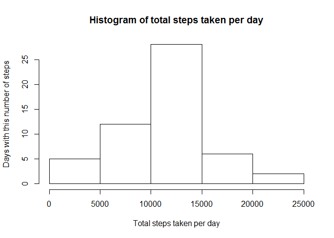
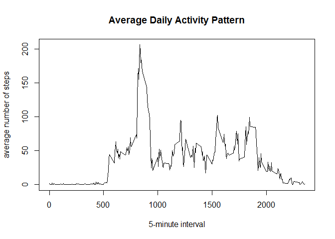
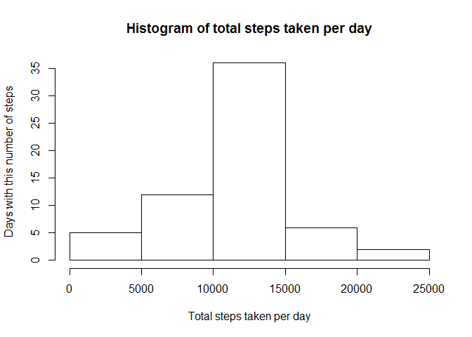
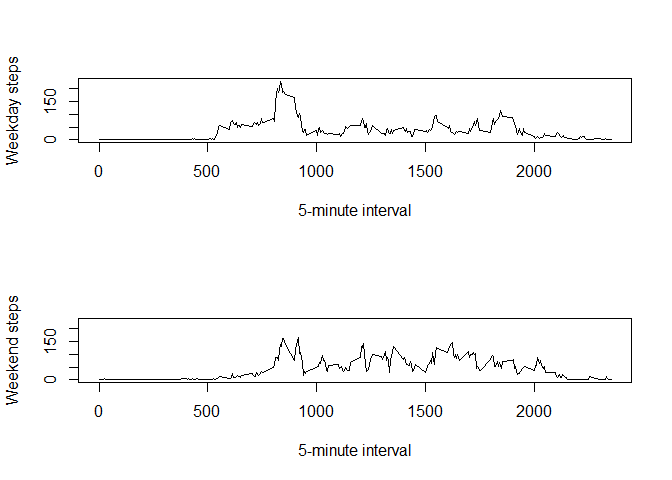

# Reproducible Research: Peer Assessment 1
Stephen Armah  
May 1, 2016  

## Loading and preprocessing the data

This code chunk will load data from the activity.csv file provided in the  github repo. first, the raw data is loaded. Then we check for incomplete cases (NA values) and remove rows that are incomplete. Finally, we convert the date field to type Date.


```r
rawActData <- read.csv("activity.csv")
rawActData$date <- as.Date(rawActData$date)
complete <- complete.cases(rawActData)
actData <- rawActData[complete,]
```

## What is mean total number of steps taken per day?

This code chunk calculates the mean of the total steps taken per day. First, we calculate the total number of steps taken per day. Then, we calculate the mean and median of those totals. Finally, we plot a histogram of those totals.


```r
totDailySteps <- tapply(actData$steps, actData$date, sum)
totDailyMean <- mean(totDailySteps)
totDailyMedian <- median(totDailySteps)
hist(totDailySteps, main="Histogram of total steps taken per day", xlab= "Total steps taken per day", ylab="Days with this number of steps")
```

<!-- -->

The mean and median total number of steps taken per day is 1.0766189\times 10^{4} and 10765 respectively. Because I used the average steps for that interval to replace missing data, there was not great variation in the mean and median values.

## What is the average daily activity pattern?


```r
totIntMean <- tapply(actData$steps, actData$interval, mean)
maxIntName <- names(totIntMean[totIntMean==max(totIntMean)])
plot(names(totIntMean), totIntMean, type="l", xlab="5-minute interval", ylab="average number of steps", main="Average Daily Activity Pattern")
```

<!-- -->

The interval with the maximum average number of steps is 835.

## Imputing missing values


```r
library(plyr)
missSteps <- sum(is.na(rawActData$steps))
impute.mean <- function(x) replace(x, is.na(x), mean(x, na.rm=TRUE))
impActData <- ddply(rawActData, ~ interval, transform, steps = impute.mean(steps))
totImpDailySteps <- tapply(impActData$steps, impActData$date, sum)
totImpDailyMean <- mean(totDailySteps)
totImpDailyMedian <- median(totDailySteps)
hist(totImpDailySteps, main="Histogram of total steps taken per day", ylab= "Total steps taken per day", xlab="Days with this number of steps")
```

<!-- -->

There are 2304 NA values in the steps column of the dataset. After imputing the missing data values, the mean and median total number of steps taken per day is 1.0766189\times 10^{4} and 10765 respectively.


## Are there differences in activity patterns between weekdays and weekends?


```r
impActData <- cbind(impActData, dow="weekday")
impActData$dow <- as.character(impActData$dow)
logDow <- (weekdays(impActData$date)=="Saturday" |
    weekdays(impActData$date)=="Sunday")
impActData[logDow,]$dow <- "weekend"
impActData$dow <- as.factor(impActData$dow)
impDayData <- subset(impActData, dow=="weekday")
impEndData <- subset(impActData, dow=="weekend")

totDayMean <- tapply(impDayData$steps, impDayData$interval, FUN=mean)
totEndMean <- tapply(impEndData$steps, impEndData$interval, FUN=mean)

rng <- range(totDayMean)

##par(mfrow=c(2,1), mar=c(.5, .5, .5, .5))
layout(matrix(c(1,2),ncol=1), widths=c(6,6), heights=c(4,4))
plot(names(totDayMean), totDayMean, type="l", xlab="5-minute interval", ylab="Weekday steps", ylim=rng)
plot(names(totEndMean), totEndMean, type="l", xlab="5-minute interval", ylab="Weekend steps", ylim=rng)
```

<!-- -->


